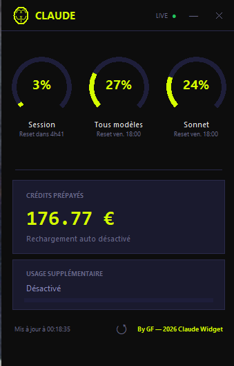
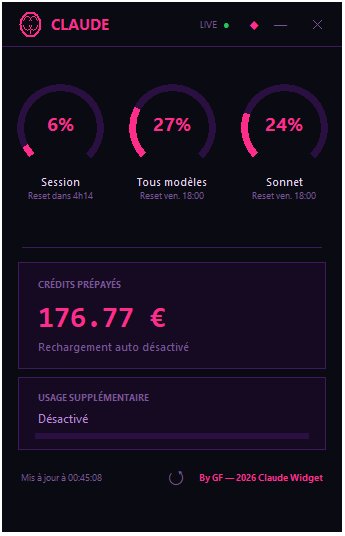
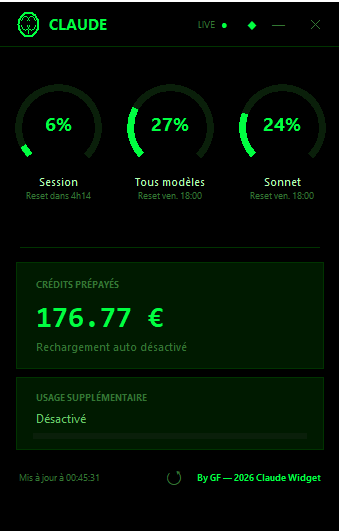
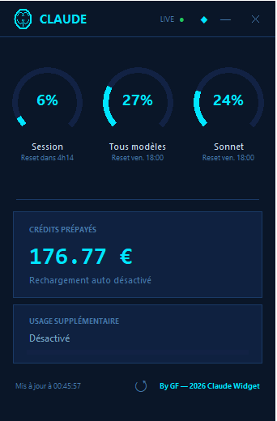
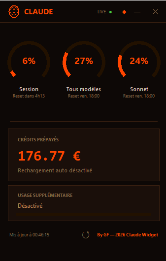

# Claude Usage Widget

A sleek, always-on-top desktop widget that displays your **Claude.ai** usage limits and prepaid credits in real time.


## Features

- **Session usage** — current 5-hour rate limit with countdown
- **Weekly limits** — all models + Sonnet-specific usage
- **Prepaid credits** — remaining balance in EUR/USD
- **Extra usage** — monthly spending if enabled
- **Auto-refresh** every 5 minutes + manual refresh
- **Always-on-top** borderless window, draggable
- **Dark glassmorphism** UI with neon yellow arc gauges

## Themes

| Neon Volt | Cyberpunk | Matrix | Arctic | Inferno |
|:---------:|:---------:|:------:|:------:|:-------:|
|  |  |  |  |  |

## Requirements

- Python 3.9+
- Windows 10/11

## Installation

```bash
git clone https://github.com/YOUR_USERNAME/claude-usage-widget.git
cd claude-usage-widget
pip install -r requirements.txt
```

## Quick Start

```bash
python claude_widget.py
```

On first launch, a **setup wizard** will guide you through the configuration:

1. Open [claude.ai](https://claude.ai) in Chrome
2. Press **F12** → go to **Application** → **Cookies** → `claude.ai`
3. The wizard will ask you to paste two values:
   - **`sessionKey`** — starts with `sk-ant-...`
   - **`lastActiveOrg`** — your organization UUID

That's it. The widget saves everything in `config.json` (excluded from git).

### Manual setup (alternative)

If you prefer, copy `config.example.json` to `config.json` and fill in the values:
```json
{
  "session_key": "sk-ant-sid02-...",
  "org_id": "xxxxxxxx-xxxx-xxxx-xxxx-xxxxxxxxxxxx"
}
```

### Launch at Windows startup

Copy `launch_widget.vbs` to your Startup folder:
```
%APPDATA%\Microsoft\Windows\Start Menu\Programs\Startup\
```
Edit the path inside `launch_widget.vbs` if your install folder is different.

## How it works

The widget uses `curl_cffi` (which impersonates Chrome's TLS fingerprint) to bypass Cloudflare and fetch data from two Claude.ai internal API endpoints:
- `/api/organizations/{org_id}/usage` — rate limits
- `/api/organizations/{org_id}/prepaid/credits` — balance

Your `sessionKey` never leaves your machine — it is only used for direct HTTPS requests to claude.ai.

## Security

- `config.json` is in `.gitignore` — your session key is never committed
- No data is sent anywhere except claude.ai
- No telemetry, no analytics, no tracking

## License

MIT

---

**By GF — 2026 Claude Widget**
